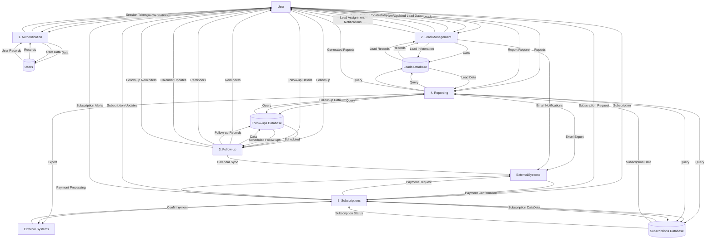

# Lead Management System - Data Flow Diagram (DFD)

## Level 1 DFD



## How to View This DFD

1. **In VS Code**:
   - Install the "Mermaid Preview" or "Markdown Preview Mermaid Support" extension
   - Open this file and click the "Open Preview" button (top-right corner)

2. **Online**:
   - Copy the Mermaid code (between the ```mermaid tags)
   - Paste it into [Mermaid Live Editor](https://mermaid.live/)

## Key Components

### External Entities
- **User**: Different roles (Super Admin, Admin, Team Leader, Sales Rep)
- **External Systems**: Email services, Payment Gateways, Excel files

### Main Processes
1. **User Authentication & Authorization**: Handles login, session management
2. **Lead Management**: CRUD operations for leads
3. **Follow-up Management**: Scheduling and tracking follow-ups
4. **Reporting & Analytics**: Generating reports and visualizations
5. **Subscription Management**: Handling plans and payments

### Data Stores
- **Users Database**: User accounts and permissions
- **Leads Database**: All lead information
- **Follow-ups Database**: Scheduled follow-ups and history
- **Subscriptions Database**: Company subscription details

## Data Flow Explanation

1. **Authentication Flow**:
   - Users provide credentials
   - System validates and returns session token
   - User data is stored/retrieved from Users Database

2. **Lead Management Flow**:
   - Users create/update leads
   - Lead data is stored in Leads Database
   - Assignment notifications are sent to users

3. **Follow-up Flow**:
   - Users schedule follow-ups
   - Follow-up data is stored in Follow-ups Database
   - Reminders and calendar updates are sent

4. **Reporting Flow**:
   - Users request reports
   - System queries relevant databases
   - Reports are generated and can be exported

5. **Subscription Flow**:
   - Users manage subscriptions
   - Payment processing with external gateways
   - Subscription data is stored and updated

## Next Steps

1. **Detailed DFDs**: Create Level 2 DFDs for each main process
2. **Data Dictionary**: Define all data elements and their formats
3. **Process Specifications**: Add detailed specifications for each process
4. **Validation Rules**: Define data validation for all inputs

---
*Last Updated: November 16, 2025*
