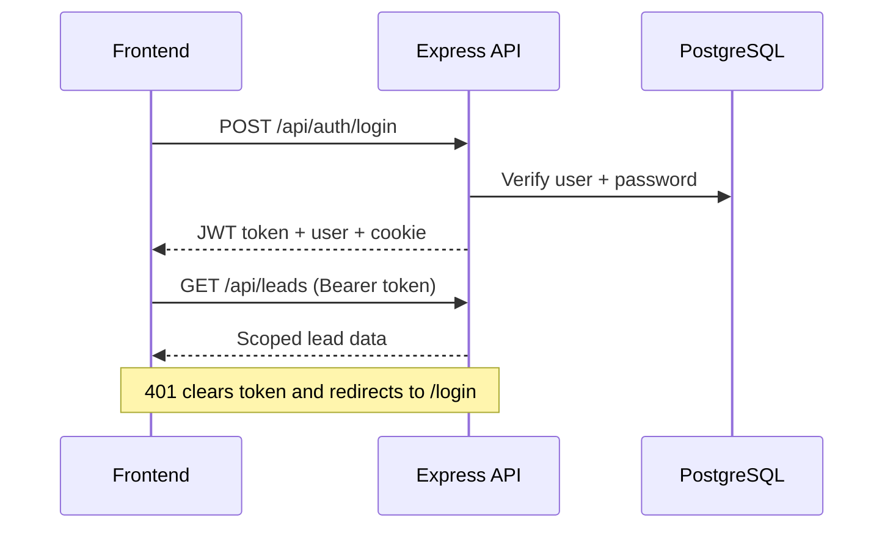

# LMS REST API Reference

**Base URL:** `/api` (dev proxy → `http://127.0.0.1:4000`)  
**Auth:** Bearer token in `Authorization` header (`lms_auth_token` in localStorage) or `lms_token` httpOnly cookie  
**Client:** [`src/api/client.ts`](../src/api/client.ts)

---

## Health (no auth)

| Method | Path | Client | Description |
|--------|------|--------|-------------|
| `GET` | `/health` | — | DB connectivity check. Returns `{ status: "ok" }` or `503`. |
| `GET` | `/api/health` | — | Same as above (duplicate for proxy setups). |

---

## Auth — `/api/auth`

| Method | Path | Auth | Client | Request | Response |
|--------|------|------|--------|---------|----------|
| `POST` | `/api/auth/login` | Public (rate-limited: 20/15min) | `api.auth.login` | `{ email, password }` | `{ user, token }` + sets cookie |
| `GET` | `/api/auth/me` | Required | `api.auth.me` | — | `{ user }` |
| `POST` | `/api/auth/logout` | Required | `api.auth.logout` | — | `{ success: true }` |

**Login errors:** `400` missing fields, `401` invalid credentials, `403` deactivated user/company.

---

## Users — `/api/users`

All routes require auth. List/create/update/delete require `MANAGE_USERS` permission.

| Method | Path | Extra guards | Client | Request | Response |
|--------|------|--------------|--------|---------|----------|
| `GET` | `/api/users` | `MANAGE_USERS` | `api.users.list` | — | `{ users: User[] }` |
| `POST` | `/api/users` | `MANAGE_USERS` | `api.users.create` | `{ name, email, password, role, companyId? }` | `{ user }` |
| `PATCH` | `/api/users/:id` | `MANAGE_USERS` | `api.users.update` | `{ name?, email?, role?, companyId?, isActive?, password?, deactivatedByCompany? }` | `{ user }` |
| `DELETE` | `/api/users/:id` | `MANAGE_USERS` | `api.users.delete` | — | `{ success: true }` |
| `DELETE` | `/api/users/by-company/:companyId` | `super_admin`, `platform_admin` | `api.users.deleteByCompany` | — | `{ success: true }` |

**Scoping:** Super admin sees all users; platform admin excludes super admins; company roles see own company only.

---

## Companies — `/api/companies`

All routes require auth.

| Method | Path | Extra guards | Client | Request | Response |
|--------|------|--------------|--------|---------|----------|
| `GET` | `/api/companies` | — | `api.companies.list` | — | `{ companies: Company[] }` |
| `GET` | `/api/companies/:id` | Company access | `api.companies.get` | — | `{ company }` |
| `POST` | `/api/companies` | `MANAGE_COMPANIES` | `api.companies.create` | `{ name, email, phone?, address?, logo?, isActive?, subscriptionPlan?, maxUsers?, monthlyPrice? }` | `{ company }` (auto `CO_YYYYMMDD_XXXX` id) |
| `PATCH` | `/api/companies/:id` | Company admin or platform | `api.companies.update` | Platform: `isActive`, `subscriptionPlan`, etc. All: `name`, `email`, `companyNameCustom`, etc. | `{ company }` |
| `DELETE` | `/api/companies/:id` | `super_admin` only | `api.companies.delete` | — | `{ success: true }` |
| `POST` | `/api/companies/:id/soft-delete` | `super_admin`, `platform_admin` | `api.companies.softDelete` | — | `{ success: true }` |

> **Unused in UI:** `POST /api/companies/:id/soft-delete` — client wrapper exists but no component calls it.

Deactivating a company (`isActive: false`) cascades to deactivate all its users.

---

## Leads — `/api/leads`

All routes require auth. Financial fields (`invoiceNo`, `projectValue`) stripped per RBAC unless user has `VIEW_FINANCIAL_DATA`.

| Method | Path | Extra guards | Client | Request | Response |
|--------|------|--------------|--------|---------|----------|
| `GET` | `/api/leads` | — | `api.leads.list` | Query: `?view=pool\|assigned\|converted\|lost`, `?limit=1–5000` | `{ leads: Lead[] }` |
| `GET` | `/api/leads/:id` | Lead access | — (not in client) | — | `{ lead }` |
| `POST` | `/api/leads/check-duplicates` | `IMPORT_LEADS` | `api.leads.checkDuplicates` | `{ field, values[], companyId? }` | `{ duplicates: string[] }` |
| `POST` | `/api/leads/check-duplicates-scoped` | `IMPORT_LEADS` | `api.leads.checkDuplicatesScoped` | `{ companyId, cins[] }` | `{ duplicates: string[] }` |
| `POST` | `/api/leads` | `IMPORT_LEADS` or platform role | `api.leads.create` | Lead object (`status`: Hot/Warm/Cold) | `{ lead }` |
| `POST` | `/api/leads/batch` | `IMPORT_LEADS` or platform role | `api.leads.batchCreate` | `{ leads: Lead[] }` (max 500) | `{ count }` |
| `PATCH` | `/api/leads/:id` | Lead write access | `api.leads.update` | Partial lead fields | `{ lead }` |
| `POST` | `/api/leads/:id/assign` | `ASSIGN_LEADS` | `api.leads.assign` | `{ userId }` | `{ success: true }` |
| `POST` | `/api/leads/:id/unassign` | `ASSIGN_LEADS` | `api.leads.unassign` | — | `{ success: true }` |
| `POST` | `/api/leads/:id/follow-up` | Lead write access | `api.leads.addFollowUp` | `{ followUp, leadUpdates? }` | `{ success: true }` |
| `POST` | `/api/leads/:id/follow-up/update` | Lead write access | `api.leads.updateFollowUp` | `{ followUp, leadUpdates? }` | `{ success: true }` |
| `POST` | `/api/leads/:id/mark-lost` | Lead write access | `api.leads.markLost` | `{ remark }` | `{ success: true }` |
| `POST` | `/api/leads/:id/restore-lost` | `RESTORE_LOST_LEADS` | `api.leads.restoreLost` | — | `{ success: true }` |
| `DELETE` | `/api/leads/:id` | `DELETE_LOST_LEADS` | `api.leads.delete` | — | `{ success: true }` (Lost only) |
| `POST` | `/api/leads/:id/mark-converted` | Lead write access | `api.leads.markConverted` | `{ invoiceNo, projectValue }` | `{ success: true }` |

**Role-based list scoping:**
- Platform roles: all leads
- Sales user: assigned leads (`assigned_to = user.id`); lost view uses `lost_by = user.id`
- Company roles: `company_id` scoped

> **Unused in UI:** `unassign`, `follow-up/update`, `mark-lost`, `mark-converted` — UI uses `addFollowUp` + `leadUpdates` instead for lost/converted flows.

---

## Events — `/api/events`

Company-scoped event bus for cross-tab sync. Polled every 3s when logged in.

| Method | Path | Client | Request | Response |
|--------|------|--------|---------|----------|
| `GET` | `/api/events/latest` | `api.events.latest` | Query: `?since=ISO8601` | `{ event: Event \| null }` |
| `POST` | `/api/events` | `api.events.emit` | `{ type, payload? }` | `{ id }` |

Emitted after lead mutations in `LeadsContext` (create, update, assign, follow-up, import, restore, delete).

---

## Config — `/api/config`

| Method | Path | Extra guards | Client | Request | Response |
|--------|------|--------------|--------|---------|----------|
| `GET` | `/api/config/branding` | Auth | `api.config.getBranding` | — | `{ systemName }` |
| `PUT` | `/api/config/branding` | `MANAGE_BRANDING` (super_admin) | `api.config.setBranding` | `{ systemName }` | `{ systemName }` |
| `GET` | `/api/config/field-config/:companyId` | Company access | `api.config.getFieldConfig` | — | `{ fieldConfigs }` |
| `PUT` | `/api/config/field-config/:companyId` | `MANAGE_SETTINGS` + company access | `api.config.setFieldConfig` | `{ fieldConfigs[] }` | `{ success: true }` |
| `GET` | `/api/config/plan-pricing` | `MANAGE_SUBSCRIPTION_PLANS` | `api.config.getPlanPricing` | — | `{ planPricing }` |
| `PUT` | `/api/config/plan-pricing` | `MANAGE_SUBSCRIPTION_PLANS` | `api.config.setPlanPricing` | `{ planPricing }` | `{ success: true }` |
| `GET` | `/api/config/website-lead-settings/:companyId` | `MANAGE_SETTINGS` + company access | `api.config.getWebsiteLeadSettings` | — | `{ autoAssignEnabled, autoAssignUserId }` |
| `PUT` | `/api/config/website-lead-settings/:companyId` | `MANAGE_SETTINGS` + company access | `api.config.setWebsiteLeadSettings` | `{ autoAssignEnabled, autoAssignUserId }` | same |

---

## Webhooks — `/api/webhooks` (no JWT)

Machine-to-machine inbound from **edunexservices.in**. Auth via `WEBHOOK_API_KEY` (`X-API-Key` or Bearer). Rate limit: 60/min.

| Method | Path | Auth | Request | Response |
|--------|------|------|---------|----------|
| `POST` | `/api/webhooks/website-leads` | API key | Website lead payload (`type`: `contact` \| `callback`) | `201` `{ ok, leadId, assigned, assignedTo }` or `200` duplicate |

Creates a **Warm** lead for `WEBSITE_LEAD_COMPANY_ID`, `uploaded_by = WEBSITE_BOT_USER_ID`. Assignment follows `websiteLeadSettings:{companyId}` (default unassigned).

Full payload + ops notes: [Website inbound webhook](website-inbound-webhook.md).

---

## Legacy Firebase Callable Functions

File: [`functions/src/index.ts`](../functions/src/index.ts) — **not REST**. Invoked via Firebase SDK only.

| Name | Roles | Description |
|------|-------|-------------|
| `adminDeleteUser` | super_admin, platform_admin | Delete Firebase Auth user + Firestore doc |
| `adminDeleteUsersByCompany` | super_admin, platform_admin | Bulk delete users by companyId |

The current app uses the Express REST API above; Firebase functions are legacy.

---

## Authentication Flow

---

## Related Documentation

- [Page Documentation Index](pages/README.md)
- [Project Documentation](../PROJECT_DOCUMENTATION.md)
