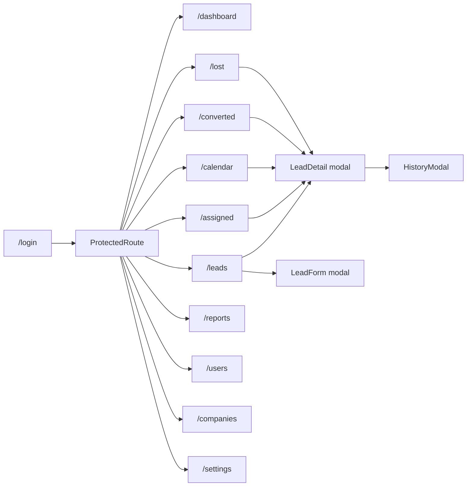

# Page Documentation Index

Comprehensive documentation for every routable page and major modal in the Lead Management System (LMS).

**App type:** React 18 + Vite SPA with React Router v7  
**Routing:** Tab-based URLs under `/:activeTab` (e.g. `/leads`, `/dashboard`)  
**Global title:** Web-based LMS for MCA Data

---

## Quick Links

### Routable Pages

| Route | Doc | Component | Sidebar Label |
|-------|-----|-----------|---------------|
| `/login` | [login.md](login.md) | `Login.tsx` | — |
| `/dashboard` | [dashboard.md](dashboard.md) | `Dashboard.tsx` / `SuperDashboard.tsx` | Dashboard |
| `/leads` | [leads.md](leads.md) | `LeadManagement.tsx` | Lead Pool |
| `/assigned` | [assigned.md](assigned.md) | `AssignedLeads.tsx` | Assigned Leads |
| `/calendar` | [calendar.md](calendar.md) | `CalendarView.tsx` | Follow-up Calendar |
| `/converted` | [converted.md](converted.md) | `ConvertedLeads.tsx` | Converted Leads |
| `/lost` | [lost.md](lost.md) | `LostLeads.tsx` | Lost Leads |
| `/reports` | [reports.md](reports.md) | `Reports.tsx` | Reports & Analytics |
| `/users` | [users.md](users.md) | `UserManagement.tsx` | User Management |
| `/companies` | [companies.md](companies.md) | `CompanyManagement.tsx` | Companies |
| `/settings` | [settings.md](settings.md) | `Settings.tsx` | Settings |
| `/subscription` | [settings.md](settings.md) | `Settings.tsx` (alias) | — |
| `/help` | — | `HelpPage.tsx` | — (AppShell icon) |

### UI/UX

| Resource | Path |
|----------|------|
| UI/UX improvements guide | [UI_UX_IMPROVEMENTS.md](../UI_UX_IMPROVEMENTS.md) |

### Modal Overlays

| Doc | Component | Opened From |
|-----|-----------|-------------|
| [modals/lead-detail.md](modals/lead-detail.md) | `LeadDetail.tsx` | Lead Pool, Assigned, Calendar, Converted, Lost |
| [modals/lead-form.md](modals/lead-form.md) | `LeadForm.tsx` | Lead Pool (add/edit) |
| [modals/history-modal.md](modals/history-modal.md) | `HistoryModal.tsx` | Lead Detail |

---

## Routing Architecture

- `/` redirects to `/dashboard`
- Invalid `/:activeTab` values redirect to `/dashboard`
- Permission-gated routes (`/users`, `/companies`, `/settings`) redirect unauthorized users to `/dashboard`

---

## Permission Matrix

Condensed from [`src/types/roles.ts`](../../src/types/roles.ts). ✅ = allowed, ❌ = denied.

| Permission | super_admin | platform_admin | company_admin | team_lead | sales_user |
|------------|:-----------:|:--------------:|:-------------:|:---------:|:----------:|
| VIEW_SUPER_DASHBOARD | ✅ | ✅ | ❌ | ❌ | ❌ |
| VIEW_DASHBOARD | ✅ | ✅ | ✅ | ✅ | ✅ |
| VIEW_LEAD_POOL | ✅ | ✅ | ✅ | ✅ | ✅ |
| VIEW_ASSIGNED_LEADS | ✅ | ✅ | ✅ | ✅ | ✅ |
| VIEW_CALENDAR | ✅ | ✅ | ✅ | ✅ | ✅ |
| VIEW_LOST_LEADS | ✅ | ✅ | ✅ | ✅ | ✅ |
| VIEW_CONVERTED_LEADS | ✅ | ✅ | ✅ | ✅ | ❌ |
| VIEW_FINANCIAL_DATA | ✅ | ❌ | ✅ | ❌ | ❌ |
| VIEW_REPORTS | ✅ | ✅ | ✅ | ✅ | ✅ |
| IMPORT_LEADS | ❌ | ❌ | ✅ | ✅ | ❌ |
| ASSIGN_LEADS | ❌ | ✅ | ✅ | ✅ | ❌ |
| RESTORE_LOST_LEADS | ✅ | ✅ | ✅ | ❌ | ❌ |
| DELETE_LOST_LEADS | ✅ | ❌ | ❌ | ❌ | ❌ |
| MANAGE_USERS | ✅ | ✅ | ✅ | ✅ | ❌ |
| MANAGE_COMPANIES | ✅ | ✅ | ❌ | ❌ | ❌ |
| MANAGE_SETTINGS | ✅ | ✅ | ✅ | ❌ | ❌ |
| MANAGE_SUBSCRIPTION_PLANS | ✅ | ❌ | ❌ | ❌ | ❌ |
| MANAGE_BRANDING | ✅ | ❌ | ❌ | ❌ | ❌ |

---

## Documentation Template

Each page doc follows this structure:

1. **Page Overview** — route, component, heading, summary
2. **User Guide** — UI elements, workflows, role differences, constraints
3. **Access & Permissions** — who can access and data scoping
4. **Developer Reference** — components, contexts, utils, event bus
5. **APIs Used on This Page** — endpoint table with triggers
6. **Related Pages** — cross-links

---

## Related Documentation

- [REST API Reference](../api-reference.md)
- [Project Documentation](../../PROJECT_DOCUMENTATION.md)
